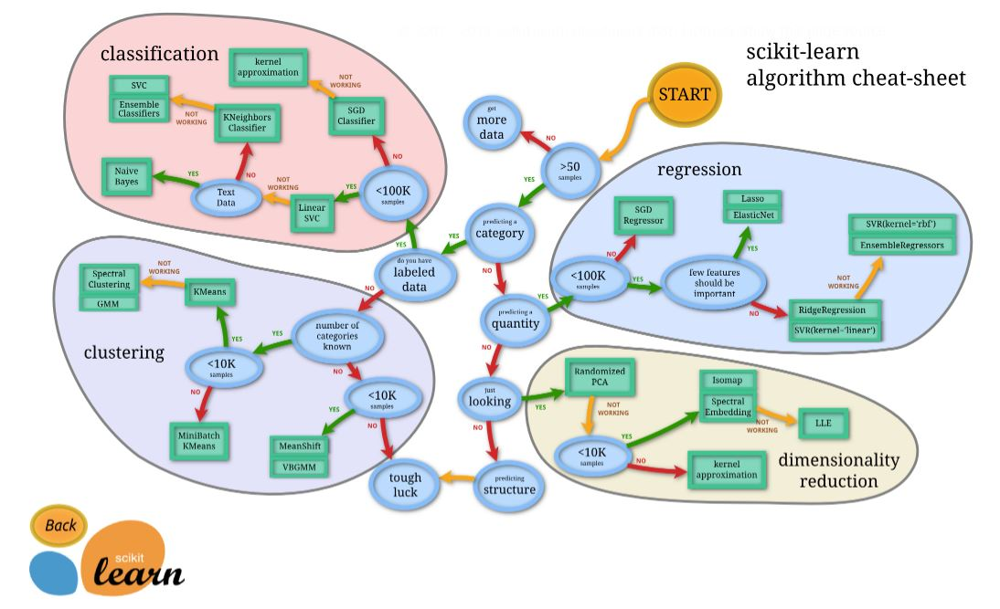

<!--
_header: ''
_footer: <br>Esta obra está bajo una [licencia de Creative Commons Reconocimiento-NoComercial-CompartirIgual 4.0 Internacional](http://creativecommons.org/licenses/by-nc-sa/4.0/). Icono diseñado por Flaticon
-->

<style type="text/css">
    img {
        background-color: transparent!important;
    }
</style>

# Machine Learning

---

## ¿Qué es el *Machine Learning*?

> **aprendizaje automático**: Conjunto de técnicas de inteligencia artificial orientadas a crear programas de computador que puedan aprender de la experiencia.

> **inteligencia artificial**: Disciplina científica que se ocupa de crear programas informáticos que ejecutan operaciones comparables a las que realiza la mente humana, como el aprendizaje o el razonamiento lógico.

---

## Aprendizaje supervisado vs no supervisado

- Aprendizaje supervisado: el aprendizaje se realiza sobre datos etiquetados.
    - Ejemplo: *queremos predecir el precio de venta de una casa a partir de un listado de casas con sus precios*

- Aprendizaje no supervisado: el aprendizaje se realiza observando los datos, sin sus etiquetas.
    - Ejemplo: *si disponemos de un listado de casas sin precios podremos determinar qué casas son similares, pero no a qué precio se venderán*

---

## Herramientas para el *machine learning*

- Python
- scikit-learn: [https://scikit-learn.org/](https://scikit-learn.org/)
- pandas: [https://pandas.pydata.org/](https://pandas.pydata.org/)
- numpy: [https://numpy.org/](https://numpy.org/)
- matplotlib: [https://matplotlib.org/](https://matplotlib.org/)
- Datalore: [https://datalore.jetbrains.com/](https://datalore.jetbrains.com/)

---



---

## Pandas

- *Pandas* permite gestionar conjuntos de datos de forma sencilla y amigable.
- Hay dos estructuras de datos principales en *pandas*:

  * **`DataFrame`**, algo así como una tabla relacional de datos, con filas y columnas con nombre.
  * **`Series`**, que representa una sucesión de valores, o lo que es lo mismo, una única columna.

---

## Pandas

Usaremos *pandas* para cargar datos desde un csv:

```python
import pandas as pd
df = pd.read_csv("https://download.mlcc.google.com/mledu-datasets/california_housing_train.csv", sep=",")
```

Y analizar los datos:

```python
df.describe()
```

```python
df.hist('housing_median_age')
```

```python
df.plot.scatter('population','median_income')
```

---

## numpy

- Numpy permite almacenar datos en matrices denominadas `ndarray`.
- Son altamente eficientes.
- Es sencillo realizar operaciones matemáticas sobre las mismas.

```python
import numpy as np
np.array([(1.5, 2, 3), (4, 5, 6)])

# array([[1.5, 2. , 3. ],
#        [4. , 5. , 6. ]])
```

--- 

## matplotlib

- Libreria empleada para dibujar gráficas

```python
import numpy as np

# rango equidistante (distancia 0.2) entre 0 y 5
t = np.arange(0., 5., 0.2)

# rayas rojas, cuadrados azules y triángulos verdes
plt.plot(t, t, color='red', linestyle='--')
plt.plot(t, t**2, color='blue', marker='s', linestyle='')
plt.plot(t, t**3, color='green', marker='^', linestyle='')

plt.show()
```
---

## Datalore

- Entorno de ejecución de Jupyter notebooks
- Ofrece un plan gratuito:
    - 120 horas de computo en CPU al mes
    - 10 GB de almacenamiento en la nube
    - Ejecución en *background* durante 6 horas
    - 2 ejecuciones en paralelo
    - Control de versiones

